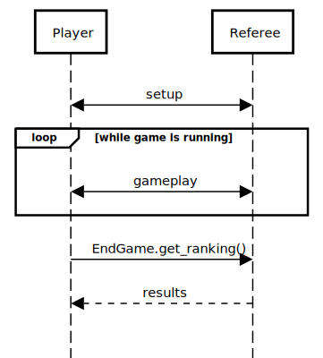
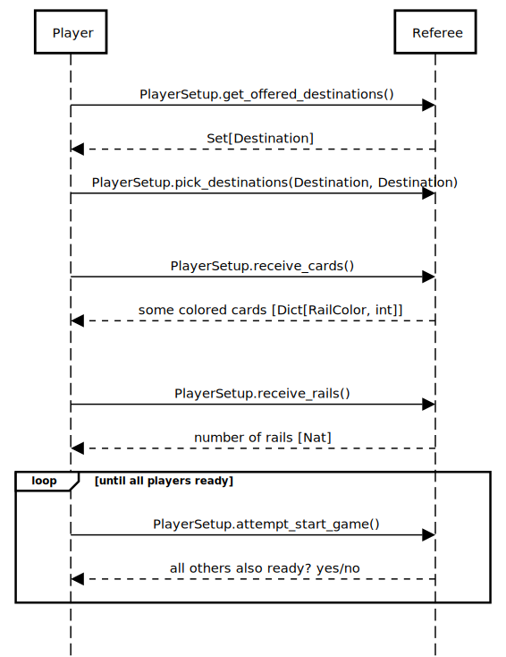
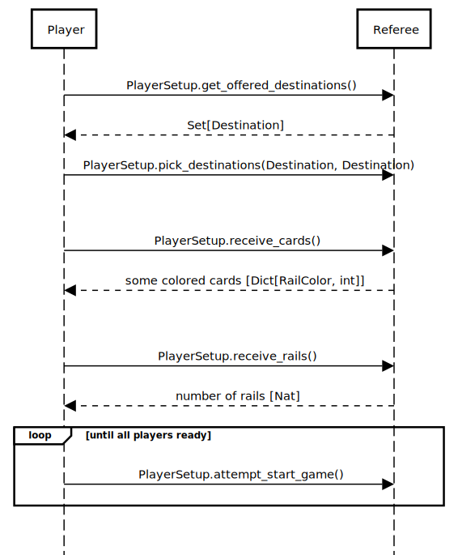
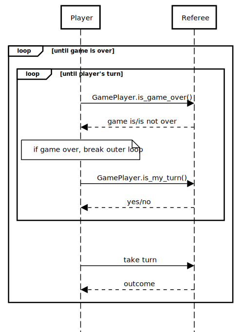

# Player Protocol

## Exceptions

If this protocol is not followed by the _player_, then at any time
the referee might respond with a `Eliminated` message instead of the
expected response. In this case, the _player_ should terminate.

## Overview

The game is played out in three stages: setup, gameplay, and end.
Gameplay loops until the game is over.

## Setup

During setup, the _player_ does two things:

- get game data
- choose destinations

### Getting Game Data

The following requests must all be made once, in any order (or even concurrently).

### Choosing Starting Pieces

After getting information about the game board, the _player_ chooses 2 _destinations_
from what the _referee_ offers to them. The _player_ also asks the _referee_
for the starting amount of _colored cards_ and _rails_.

A _player_ declares that they are "ready" to start the game by calling
`PlayerSetup.attempt_start_game()`. The _referee_ responds to this request
with `yes` if all participants have also called `PlayerSetup.attempt_start_game()`,
or `no` if there is a participant who has not called `PlayerSetup.attempt_start_game()`.
If the response to `PlayerSetup.attempt_start_game()` is `no`, then the _player_
is to poll the _referee_ with `PlayerSetup.attempt_start_game()` until the response
is `yes`.

## Gameplay

During gameplay, the _player_ repeats the three following actions:

1. checking if the game is over
2. checking if it is the _player_'s turn
3. taking their turn

The gameplay phase ends when the game is over.

### Checking if the game is over

First, a _player_ calls `GamePlayer.is_game_over()` before anything else.
If the game is over, then exit the gameplay phase and continue onto
[Viewing Results](#Viewing-Results).

Next, the _player_ will wait for their turn by polling the _referee_ with
`GamePlayer.is_my_turn()`.

### Taking a Turn

When it is the player's turn, it can do one of two things:

- Request cards to be added to their hand
- Attempt to acquire a connection between two places

#### Acquiring connections

The player may choose to acquire _connections_ only if it has enough
_colored cards_ and _rails_ to do so. To acquire a connection, it calls
`GamePlayer.acquire_connection(TrainConnection)` to inform the _referee_
of the _connection_ the _player_ wishes to acquire.

#### Drawing cards

If a _player_ wishes to draw cards from the draw pile, it calls
`GamePlayer.draw_cards()`.

## Viewing Results

Once a _player_ has received an `EndGame` from `GamePlayer.is_game_over()`,
it calls `EndGame.get_ranking()` to receive the results of the game.
